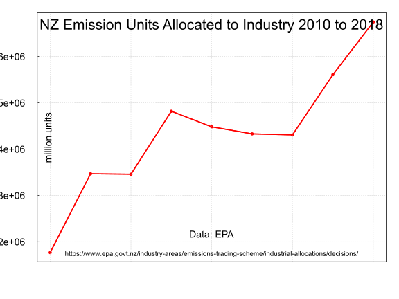

## Industrial Allocation of New Zealand Emission Units to Industry under the New Zealand Emissions Trading Scheme 2010 to 2018. 

### Description

The New Zealand [Environmental Protection Authority](https://www.epa.govt.nz) manages the [New Zealand Emissions Trading Scheme](https://www.epa.govt.nz/industry-areas/emissions-trading-scheme/). 

Emissions units are allocated to [participant emitting industries](https://www.epa.govt.nz/industry-areas/emissions-trading-scheme/industries-in-the-emissions-trading-scheme/) each calendar year. This is the annual [Industrial Allocation](https://www.epa.govt.nz/industry-areas/emissions-trading-scheme/industrial-allocations/) of emissions units to emitting industries.
    
The New Zealand [Environmental Protection Authority](https://www.epa.govt.nz) publishes the final industrial allocation of emission units annually on it's [website](https://www.epa.govt.nz/industry-areas/emissions-trading-scheme/industrial-allocations/decisions/)

This data repository provides a reproducible public domain data series of the Industrial Allocation of New Zealand emission units.

### Data Preparation

#### Requirements

Data preparation was performed with the [OpenRefine progam](http://github.com/OpenRefine/OpenRefine/) and the [R programming language](https://www.r-project.org/about.html), R version 3.6.0 (2019-04-26) with the [RKWard 0.6.5 IDE](https://rkward.kde.org/) running on an i586-pc-linux-gnu (64-bit), [Debian GNU/Linux 9 (Stretch) MX-18](https://mxlinux.org/index.php) operating system.

#### Processing

To obtain the data, create a new Google sheet. Insert the url of the EPA Industrial allocation decision webpage [https://www.epa.govt.nz/industry-areas/emissions-trading-scheme/industrial-allocations/decisions/](https://www.epa.govt.nz/industry-areas/emissions-trading-scheme/industrial-allocations/decisions/) into cell 'A1'. Insert the text '=importhtml(A1,"table",1)' into cell A2. And the full table of the 2018 year unit allocation data appears in the sheet. Repeat for years 2010 to 2017.

Download the data in .csv format from Google sheets to the same folder as OpenRefine.

open a terminal window and change to the OpenRefine directory

type cd /home/user/Refine/openrefine-3.2/

to start OpenRefine type './refine' and press enter

wait for Firefox to start at IP http://127.0.0.1:3333/ which is OpenRefine. Or enter the url http://127.0.0.1:3333/ into your browser address bar

Browse to and select a .csv data file

Click on 'Next' button and 'create new project' 
 
Select and tick 'ignore first line at the beginning of the file 

Tick 'Parse next 1 line as column headers'

Click on 'create new project'

We should have 108 rows of data - look the second column, it mixes two variables, 'Applicants name' and 'Activity'

Edit column - Add new column 'Activity' based on column *Activity and Applicant's Name* - add name 'Activity'

write " if(value.startsWith("*"), value[1,37],"")" into the Expression box. That moves only the activities into their own column. Select ok. there is now a column named 'Activity' and each cell contents ends with * as the leading * has been excluded.

Edit column, Add column based on column Applicants Name called 'Name'

in the Expression box , leave 'value' in box and copy the column by selecting 'ok'.

Select Activity column, edit cells, fill down (fills all Activitys to empty cells)

Edit column - Add new column 'Year' based on column *Activity and Applicant's Name* - add name 'Year' and value '2018' in expression box

Select the header *2018 Final Unit Entitlement*, select Facet, numeric facet, go to left side of dashboard, untick 'numeric' box, leave 'blank' box (24 records) ticked,

Select column 'All', then Edit rows, remove all matching rows (that leaves 84 rows with no blank cells in *2018 Final Unit Entitlement*), then tick boxes numeric and non-numeric. 

Select column *Activity and Applicant's Name*, Edit column, Remove this column

Select column *Activity", Edit column - Add new column 'Activity' based on column 'Activity2' - add name 'Activity' and expression in box enter value.replace("*","") - to remove the *

Select column 'Final Entitlement' , add name 'Allocation' Edit column - Add new column and expression in box enter value.replace(",","") to remove commas, Edit column, remove column 'Final Entitlement'.

Select the column Allocation, edit cells, common transforms, To number

Click on the data project name at the top and just right of the "OpenRefine" label "NZ-emission-unit-industrial-allocation-decisions-EPA-2010-2018-Sheet1-csv". Chnage the name to "NZ emission unit industrial allocation decisions EPA 2018 tidy"  

Select 'Export' (in top right corner) as .csv file

Upload the csv file to Google Drive via the [Gdrive](https://github.com/prasmussen/gdrive") command line utility

Follow steps in the R script file Sum-allocation-2010-2018.r

### License

#### ODC-PDDL-1.0

These datasets and the R script are made available under the Public Domain Dedication and License v1.0 whose full text can be found at: http://www.opendatacommons.org/licenses/pddl/1.0/. You are free to share, to copy, distribute and use the data, to create or produce works from the data and to adapt, modify, transform and build upon the data, without restriction.

#### Index of data and script files

1. NZETS-2010-final-allocations-for-eligible-activities.csv

2. NZETS-2011-final-allocations-for-eligible-activities.csv

3. NZETS-2012-final-allocations-for-eligible-activities.csv

4. NZETS-2013-final-allocations-for-eligible-activities.csv

5. NZETS-2014-final-allocations-for-eligible-activities.csv

6. NZETS-2015-final-allocations-for-eligible-activities.csv

7. NZ-emission-unit-industrial-allocation-decisions-EPA-2016-tidy.csv

8. NZ-emission-unit-industrial-allocation-decisions-EPA-2017-tidy.csv

9. NZ-emission-unit-industrial-allocation-decisions-EPA-2018-tidy.csv

10. nzu2010to2018.csv, the output data, the emissions units allocated each year by Activity and Name and market value

11. Sum-allocation-2010-2018.r, the R script file of code

12. [Licence.txt](https://github.com/theecanmole/nzu/blob/master/Licence.txt) (Public Domain  Dedication and License v1.0 http://opendatacommons.org/licenses/pddl/1.0/)

#### Citation

