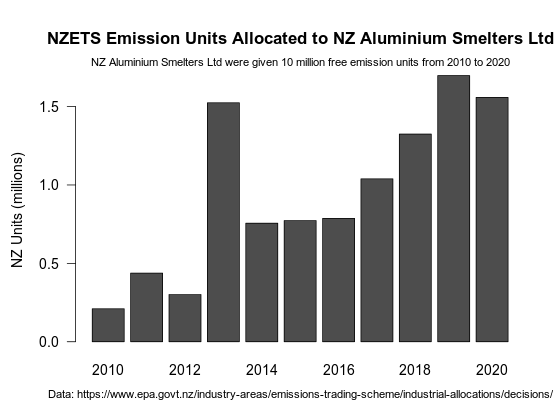
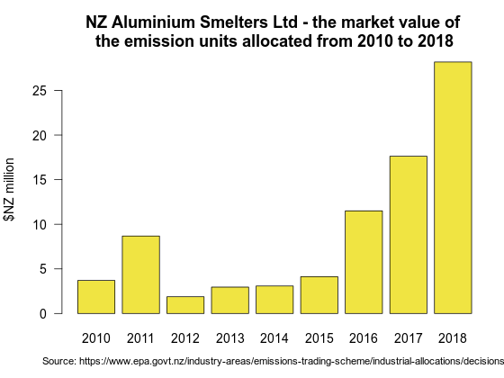

## Industrial Allocation of New Zealand Emission Units to Industry under the New Zealand Emissions Trading Scheme 2010 to 2018. 

### Description

The New Zealand [Environmental Protection Authority](https://www.epa.govt.nz) manages the [New Zealand Emissions Trading Scheme](https://www.epa.govt.nz/industry-areas/emissions-trading-scheme/). 

Emissions units are allocated to [participant emitting industries](https://www.epa.govt.nz/industry-areas/emissions-trading-scheme/industries-in-the-emissions-trading-scheme/) each calendar year. This is the annual [Industrial Allocation](https://www.epa.govt.nz/industry-areas/emissions-trading-scheme/industrial-allocations/) of emissions units to emitting industries.
    
The New Zealand [Environmental Protection Authority](https://www.epa.govt.nz) publishes the final industrial allocation of emission units annually on it's [website](https://www.epa.govt.nz/industry-areas/emissions-trading-scheme/industrial-allocations/decisions/)

This data repository provides a reproducible public domain data series of the Industrial Allocation of New Zealand emission units.

### Data Preparation

#### Requirements

Data preparation was performed with [R version 3.6.0](https://cran.r-project.org/) with the [RKWard 0.6.5 IDE](https://rkward.kde.org/) running on an i586-pc-linux-gnu (64-bit), [Debian GNU/Linux 9 (Stretch) MX-18](https://mxlinux.org/index.php) operating system.

#### Processing


Follow steps in the R script file Sum-allocation-2010-2018.r

Create a bar chart in svg format

```{r}
svg(filename ="NZAL-2010-2020-allocations_720-540.svg", width = 8, height = 6, pointsize = 14, onefile = FALSE, family = "sans", bg = "white")
par(mar=c(4.4, 4.4, 4.4, 2)+0.1)
barplot(nzalmatrix1/10^6,las=1) 
title(cex.main=1.2,main="NZETS Emission Units Allocated to NZ Aluminium Smelters Ltd",ylab="NZ Units (millions)")
mtext(side=3,line=0.25,cex=0.8,expression(paste("NZ Aluminium Smelters Ltd were given 12 million free emission units from 2010 to 2020")))
mtext(side=1,line=2.5,cex=0.8,expression(paste("Data: https://www.epa.govt.nz/industry-areas/emissions-trading-scheme/industrial-allocations/decisions/")))
dev.off()
```
 
Create a line graph of the total allocations by year in svg format
```{r}
svg(filename ="annualallocationsline_720-540.svg", width = 8, height = 6, pointsize = 14, onefile = FALSE, family = "sans", bg = "white")    
par(mar=c(3.1,4.1,1,1)+0.1)
plot(annualallocations[["Year"]],annualallocations[["Allocation"]]/10^6,ylim=c(0,8),tck=0.01, axes=T,ann=T,las=1,pch=20, cex=0.75,type="o",col=2,lwd=2)
axis(side=2, tck=0.01, at = NULL, labels = NULL, tick = T,lwd=0,lwd.tick=1,las=1)
grid()
box()
lines(annualallocations,col=2,lwd=2,lty=1)
mtext(side=2,cex=1, line=-1.5,expression(paste("million units")))
mtext(side=3,cex=1.3, line=-2,expression(paste("NZ Emission Units Allocated to Industry 2010 to 2018")))
mtext(side=1,line=-2,cex=1,expression(paste("Data: EPA")))
mtext(side=1,cex=0.7, line=-1.3,"https://www.epa.govt.nz/industry-areas/emissions-trading-scheme/industrial-allocations/decisions/")
dev.off()
```





 

### License

#### ODC-PDDL-1.0

These datasets and the R script are made available under the Public Domain Dedication and License v1.0 whose full text can be found at: http://www.opendatacommons.org/licenses/pddl/1.0/. You are free to share, to copy, distribute and use the data, to create or produce works from the data and to adapt, modify, transform and build upon the data, without restriction.


#### Index of data and script files

1. NZETS-2010-final-allocations-for-eligible-activities.csv

2. NZETS-2011-final-allocations-for-eligible-activities.csv

3. NZETS-2012-final-allocations-for-eligible-activities.csv

4. NZETS-2013-final-allocations-for-eligible-activities.csv

5. NZETS-2014-final-allocations-for-eligible-activities.csv

6. NZETS-2015-final-allocations-for-eligible-activities.csv

7. NZ-emission-unit-industrial-allocation-decisions-EPA-2016-tidy.csv

8. NZ-emission-unit-industrial-allocation-decisions-EPA-2017-tidy.csv

9. NZ-emission-unit-industrial-allocation-decisions-EPA-2018-tidy.csv

10. nzu2010to2018.csv, the output data, the emissions units allocated each year by Activity and Name and market value

11. Sum-allocation-2010-2018.r, the R script file of code

12. [Licence.txt](https://github.com/theecanmole/nzu/blob/master/Licence.txt) (Public Domain  Dedication and License v1.0 http://opendatacommons.org/licenses/pddl/1.0/)

#### Citation

