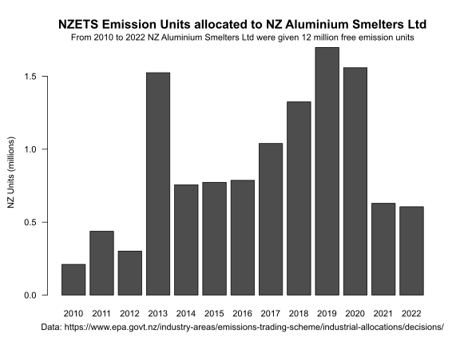
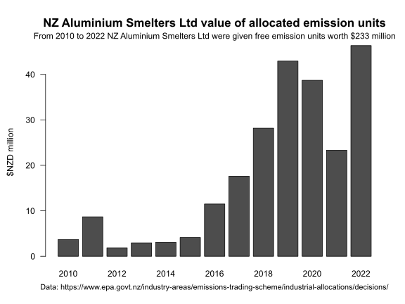

## How many emission units have been allocated to New Zealand Aluminium Smelters Limited under the New Zealand Emissions Trading Scheme? 

How many emission units have been allocated to New Zealand Aluminium Smelters Limited under the New Zealand Emissions Trading Scheme? What was their market value when they were allocated? What is the total value of the units given since 2010?

Follow the steps in the R script file Sum-allocation-2010-2018.r

This table sets out the final allocation of emission units allocated each year, the May market price and an estimated market value at the May price (based on the assumption that almost all of the units are transferred at the time of the provisional allocation of the current year which is also the 'wash-up' of the prior years final allocation).

|   Year |Final units allocated | May unit value | Total value |
|----	 |----        |----   |----     |	
|  2010  |    210,421  | 17.6  | 3,699,201|
|   2011 |    437,681  | 19.8  | 8,683,591|
|   2012 |    301,244  |  6.23 | 1,876,750|
|   2013 |  1,524,172  |  1.94 | 2,956,894|
|   2014 |    755,987  |  4.08 | 3,084,427|
|   2015 |    772,706  |  5.34 | 4,126,250|
|   2016 |    786,306  | 14.6  |11,503,657|
|   2017 |  1,038,914  | 17.0  |17,619,981|
|   2018 |  1,324,556  | 21.3  |28,186,552|
|  2019  |  1,697,437  | 25.3  |42,928,182|
|  2020  |  1,558,268  | 24.8  |38,707,377|
|  2021  |    628,561  | 37.1  |23,344,756|
|  2022  |    605,320  | 76.6  |46,337,246|
|TOTAL	 | 11,641,573  |N/A    |233 054,863|

### Background to free allocation of emission units

The New Zealand [Environmental Protection Authority](https://www.epa.govt.nz) manages the [New Zealand Emissions Trading Scheme](https://www.epa.govt.nz/industry-areas/emissions-trading-scheme/). 

Free missions units are allocated (gifted for no cost) to [participant emitting industries](https://www.epa.govt.nz/industry-areas/emissions-trading-scheme/industries-in-the-emissions-trading-scheme/) each calendar year. This is the annual [Industrial Allocation](https://www.epa.govt.nz/industry-areas/emissions-trading-scheme/industrial-allocations/) of emissions units to emitting industries.
    
The New Zealand [Environmental Protection Authority](https://www.epa.govt.nz) (EPA) publishes the final industrial allocation of emission units annually on it's website [Industrial allocations decisions](https://www.epa.govt.nz/industry-areas/emissions-trading-scheme/industrial-allocations/decisions/)

The EPA website states at; [EPA Provisional Allocation](https://www.epa.govt.nz/industry-areas/emissions-trading-scheme/industrial-allocations/how-to-apply/) 
*"If you Apply for a Provisional Allocation you receive your entitlement in advance, based on your production for the previous calendar year. To ‘square up’ your entitlement with what you actually produced, in the next application period you’re required to submit an allocation adjustment".*

The EPA website states at; [EPA application deadlines](https://www.epa.govt.nz/industry-areas/emissions-trading-scheme/industrial-allocations/how-to-apply/) 
*"You must submit your application via the Register by the following statutory deadlines: Provisional allocation applications: Apply between 1 January - 30 April of the year for which you wish to receive NZUs. Final allocation applications and annual allocation adjustments: Apply between 1 January - 30 April of the year following the year for which you wish to receive NZUs".*

The EPA website also discloses a complete record of all industry final allocations in a MS Excel workbook [Industrial-Allocations-Final-Decisions.xlsx](https://www.epa.govt.nz/assets/Uploads/Documents/Emissions-Trading-Scheme/Reports/Industrial-Allocations/Industrial-Allocations-Final-Decisions.xlsx)

### Provisional allocations

Each year, from 1 May, the EPA makes a [provisional allocation](https://www.epa.govt.nz/industry-areas/emissions-trading-scheme/industrial-allocations/) of emission units to selected industries. I want to estimate the market value of each years free allocation of units. I understand that the deadline for a provisional allocation is 30 April of each year so I assume the transfer of the emission units is made in May of each year. I assume that the provisional allocation for the current year (and the wash-up calculation of the final allocation for the previous year) are transferred to the emitter in May.

### Average May emission unit price

There is an online 'open data' Github repository of New Zealand Unit (NZU) prices going back to May 2010. This data set has it's own citation and DOI: Theecanmole. (2016). [New Zealand emission unit (NZU) monthly prices](https://github.com/theecanmole/nzu) [V1.0.01 [Data set]. Zenodo](http://doi.org/10.5281/zenodo.221328). I add a market price for the units at the May average price from 2010 to 2020 to the annual allocation data. 

How do I estimate the 2021 provisional allocation that was probably processed by EPA in May 2021? It is based on prior year 2020 actual production see [Section 81(1) of the Climate Change Response Act 2002](https://www.legislation.govt.nz/act/public/2002/0040/latest/DLM1662643.html). So obtain the 2020 final allocation of units and divide by 2020 final "allocative baseline" from [Regulation 7 of the Climate Change (Eligible Industrial Activities) Regulations 2010](https://www.legislation.govt.nz/regulation/public/2010/0189/latest/DLM3075118.html). The final 2020 allocation of units multiplied by the 2021 allocation baseline equals the 2021 provisional allocation. 

### License

#### ODC-PDDL-1.0

These datasets and the R script are made available under the Public Domain Dedication and License v1.0 whose full text can be found at: http://www.opendatacommons.org/licenses/pddl/1.0/. You are free to share, to copy, distribute and use the data, to create or produce works from the data and to adapt, modify, transform and build upon the data, without restriction.

[Licence.txt](https://github.com/theecanmole/nzu/blob/master/Licence.txt) (Public Domain  Dedication and License v1.0 http://opendatacommons.org/licenses/pddl/1.0/)
